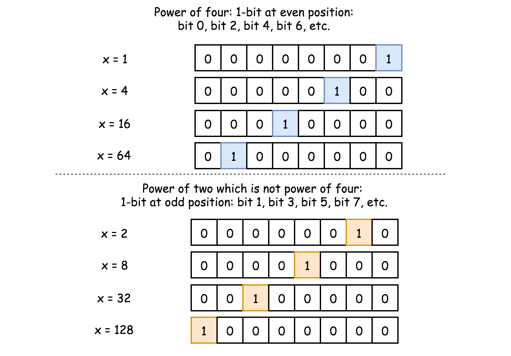

 
 
 
## 简介
- [题目链接](https://leetcode-cn.com/problems/power-of-four/)

## 思路
### 解法一 - 暴力法
运用数学原理，$4^n = 4 \times 4 \times ... \times 4$。因此，我们可以不断的对输入的整数进行取余和整除操作。

``` javascript
/**
 * @param {number} num
 * @return {boolean}
 */
var isPowerOfFour = function(num) {
    if(num < 1) return false;

    while(num % 4 === 0) {
      num /= 4;
    }
    return num === 1;
};
```

**复杂度分析**:
- 时间复杂度： $O(logN)$，$N$ 是数字大小
- 空间复杂度：$O(1)$

### 解法二 - 枚举
因为给定的数 num 是 32 位整型，其能够表达的最大正整数是 $2^{31}-1$，范围内最大的 4 的幂是 $4^{15}$。因此我们可以哈希表把所有的 32 位整型以内的 4 的幂存储起来。后面直接查表即可。

```javascript
var isPowerOfFour = function(num) {
    let map = {};
    let tmp = 1;
    for(let i = 0; i <= 15; i++) {
      map[tmp] = true;
      tmp *= 4;
    }

    return map[num] === true;  
};
```

**复杂度分析**:
- 时间复杂度：$O(1)$
- 空间复杂度：$O(1)$

### 解法三 - 位运算
我们知道 $4^n = 2^{2n}$，而2的幂可以通过：
`x & x-1 = 0` 或者 `x & -x = x` 来判断。

1. 如果 num 小于 1， 返回 false
2. 首先判断 num 是否是 2 的幂。如果不是，返回 false，如果是，继续下面的步骤
3. 直接 $\log_2(num)$ ，看得到的值是否是偶数。

```javascript
var isPowerOfFour = function(num) {
    if(num < 1) return false;

    if((num & num-1) !== 0) return false;

    return Math.log2(num) % 2 === 0;
};
```

**复杂度分析**:
- 时间复杂度：$O(1)$，具体取决于 `Math.log2` 如何实现
- 空间复杂度：$O(1)$


### 解法四 - 位运算的不同处理
看下图(图片来自官方 LeetCode)：


因此，4的幂和 $101010....10_2$ 与运算为0，而32位整型的该数可以直接表示为 $aaaaaaaa_{16}$。

```javascript
var isPowerOfFour = function(num) {
return  num > 0 && (num & num-1) === 0 && (num & 0xaaaaaaaa) === 0;
};
```

**复杂度分析**:
- 时间复杂度：$O(1)$
- 空间复杂度：$O(1)$