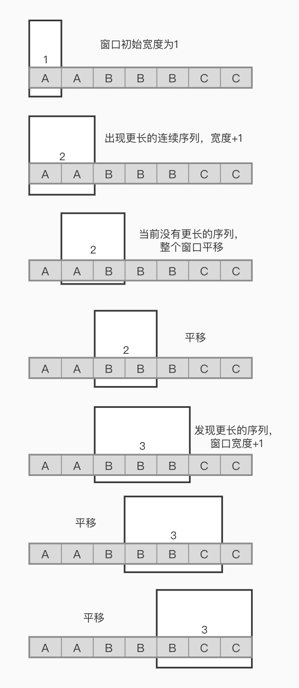

 
 
 
## 简介
- [题目链接](https://leetcode-cn.com/problems/longest-repeating-character-replacement/)

本题特例化 $k=0$ 时就是求最长重复子串问题。

## 思路
### 解法一 - 滑动窗口
假设在字符串上有一个窗口，我们统计窗口里面最多字符的次数，假定为 max，而需要替换字符的个数为 $window - max$。我们不断移动窗口右边界，直到替换个数大于设定的 $k$。此时，我们在更新左边界，缩小窗口，知道替换的个数重新小于 $k$。循环上述过程，直到遍历结束。

```javascript
/**
 * @param {string} s
 * @param {number} k
 * @return {number}
 */
var characterReplacement = function(s, k) {
    let left = 0;
    let right = 0;
    let ans = 0;
    let maxCount = 0;
    let count = new Array(26).fill(0);

    while(right < s.length) {
      count[s.charCodeAt(right) - 65]++;
      maxCount = Math.max(maxCount, count[s.charCodeAt(right) - 65]);
      right++;

      while(right-left-maxCount > k) {
        count[s.charCodeAt(left) - 65]--;
        maxCount = findMax(count);
        left++;
      }
      ans = Math.max(ans, right-left);
    }
    return ans;

    function findMax(arr) {
      let max = 0;
      for(let i = 0; i < arr.length; i++) max = Math.max(max, arr[i]);
      return max;
    }
};
```

**复杂度分析**:
- 时间复杂度：$O(N)$，左右指针各自从 $0$ 遍历到 $N$。
- 空间复杂度：$O(1)$


在仔细分析下滑动窗口的套路，其实总体有两种：
1. 套路一：
    1. 扩大右边界，直到不满足要求
    2. 移动左边界，直到再次满足要求
    3. 循环步骤 1 和 2，得出答案。

2. 套路二：
    1. 扩大右边界，直到不满足要求
    2. 不缩小窗口大小，而是整体向右移动窗口位置。为什么？这是因为如果整体移动后仍然不满足要求，此时所在的可能解不可能超过历史的最优解。因此，我们要移动窗口直到再次满足要求。
    3. 重复步骤 1 和 2，得出答案



具体使用哪种看具体题目情况，有些时候套路二会更加优秀，比如本题。

### 解法二 - 滑动窗口优化
使用套路二来优化 $findMax$ 方法。
```javascript
var characterReplacement = function(s, k) {
    let left = 0;
    let right = 0;
    let maxCount = 0;
    let count = new Array(26).fill(0);

    while(right < s.length) {
      count[s.charCodeAt(right) - 65]++;
      maxCount = Math.max(maxCount, count[s.charCodeAt(right) - 65]);
      right++;

      if(right-left-maxCount > k) {
        count[s.charCodeAt(left) - 65]--;
        left++;
      }
    }
    return right-left;

};
```
**复杂度分析**:
- 时间复杂度：$O(N)$，左右指针各自从 $0$ 遍历到 $N$。本解法优化 $findMax$，而 $findMax$ 的时间复杂度是 $O(26)$。这样极大地优化了常系数。
- 空间复杂度：$O(1)$