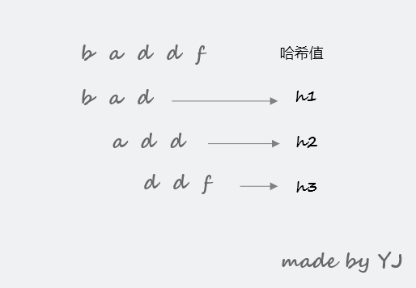
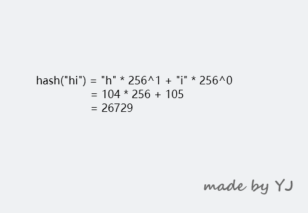
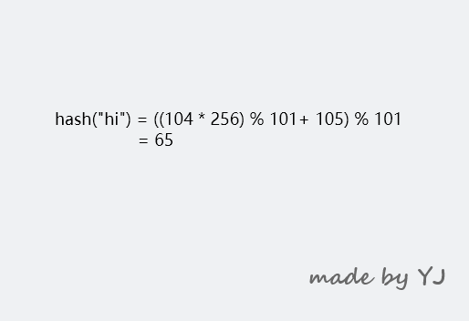
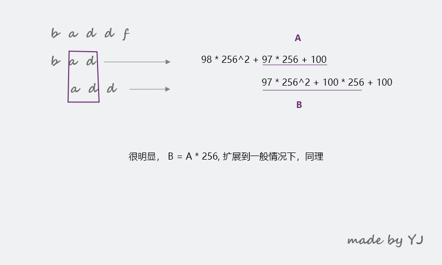

**文本更新于 2020年04月27日 18:06:44**
## 简介
本篇主要对BF 算法和 RK 算法进行讲解。

## BF 算法
> BY： 万法皆起于此

BF 是 Brute Force 的缩写，中文叫做暴力匹配算法，也被称为朴素匹配算法。其相对于其他算法来讲，简单、易懂，却性能不高。

**首先，什么是单模式匹配？**
举个例子，我们有个需求，需要在字符串 A 中查找字符串 B，那么我们就将字符串 A 称为 **主串**，字符串 B 就被称为 **模式串**。而查找的字符串 B 只有一个，因此也就被称为单模式匹配。通常来讲，我们认为 A 的长度大于 B。

BF 算法作为最简单的字符串匹配算法，其思想概括起来就是：**枚举字符串 A 中所有可能的子字符串（子字符串的要求是和模式串长度相同），然后分别将这些子字符串和模式串 B 一一比对匹配**


BF 算法的时间复杂度理论上很高，在最坏情况下我们需要比对 $n-m+1$ 次，因此时间复杂度是 $O(n*m)$，这里 $n$ 和 $m$ 分别是 A 和 B 的长度。

**但是，我们要知道学术理论上和工程实践上是有区别的。在统计意义上来讲，最坏情况发生的次数是很少的。在实际开发过程中，很多需求都不复杂，此时代码实现简单就成了我们的首选**


如果想要优化 BF 算法，简单来讲有两个方向：
1. 减少单个子串和模式串的比对时间，其中的典型就是 RK 算法
2. 每次移动时尽可能多的向后移动，而不是每次只移动一位，其中的典型就是 KMP、BM 等算法
 
## RK 算法
RK 算法全称叫做 Rabin-Karp 算法，由其发明者名字命名，出现于 1987年。它通过引入哈希算法来优化单个子串与模式串比对的效率，具体思路如下：
- 我们通过哈希算法对主串的 $n-m+1$ 个子串分别求哈希值，然后逐个与模式串的哈希值比较大小。如果某个子串的哈希值与模式串相等，那就说明对应的子串和模式串可能匹配（这里用可能，是因为哈希冲突的问题）。因为哈希值是一个数字，数字之间的比较是非常迅速的，所以模式串和子串的比对效率就大大提升了。



此时，整体算法的效率约束出现在如何对 $n-m+1$ 个子串分别求哈希值上面。我们知道，通过哈希算法对长度为 $m$ 的子串求哈希值的时间复杂度为 $O(m)$（原因在于需要计算子串中每个字符）。如果我们使用暴力方式计算所有子串，则整体的算法效率和 BF 算法没什么两样。因此，我们需要新的技巧，而该技巧被称为 rolling hash（滚动哈希）。

rolling hash 对应着一系列的哈希函数（hash function），其不仅仅可以被用在 RK 算法中，还可以用在很多其他应用当中，比如 low bandwidth network filesystem(LBFS) 、rsync 等。

rolling hash 具体使用了滑动窗口的算法技巧（一种高级双指针技巧，LeetCode 有很多该思路的题目），复用前面子串已经计算过的哈希值，将 $n-m+1$ 个子串的哈希值计算时间由 $O(n*m)$ 降低到了 $O(n)$。在这里，我们只讲解一种最常见的被用在 RK 算法中的 rolling hash。

第一种叫做 polynomial rolling hash（多项式滚动哈希），其内部只使用加法和乘法。
$H = c_1a^{k-1} + c_2a^{k-2} + c_3a^{k-3}+...+c_ka^{0}$， 这里 $a$ 是一个常数， $c_1, ... , c_k$ 代表着子串各个字符的编码值（比如我们可以采用ascii）。在这里如果子串很长，$H$ 的值可能会很大，甚至超过计算机精度的表示范围，因此我们需要一种优化方式，比如对其进行模运算。**具体多项式 rolling hash 是否性能优异取决于 $a$ 和 $n$ 的选择，这里不详细描述选择的技巧**。

polynomial rolling hash 是我们在实际工程中的首选，它和接下来要介绍的 rabin fingerprint 具有同等的性能，下面我们通过一个例子来详细了解它：
先将文本的所属字符集全部编号（比如使用 ascii 进行编号），此时所有可能出现的字符都会对应一个唯一的数字编号。如果使用 ascii 编码，那么 104 就 表示 $h$。而任意子串可以表示为一个 $K$ 进制数（这里的 base 我们采用 ascii 最大的表示数 256） ，**而我们的 hash function 就是将这个 $K$ 进制数转换为十进制数。**



这种简单的计算很容易带来一个问题，产生的 hash 值会超过计算机表示的精度（这里不考虑大数表示）。因此我们采用模运算技巧，具体的 modulus 选取 101（从这里我们可以看出，模数的取值可以小于 base 的取值）。 


到了这里，我们已经设计了具体的 hash function 细节。那么我们在前面所说的 rolling hash 又是如何达到计算目的的呢？


因此，我们可以推广到一般情况下($h(i)$ 表示开始下标为 $i$ 的子串哈希值，子串表示为 $s[i...m+i-1]$)：

$h(i) = (h(i-1) - 256^{m-1}*s[i-1]) * 256 + s[i+m-1] * 256^0$，再加上模运算就得到了我们最终的多项式滚动哈希函数。**这里我们可以通过查表的方式进一步优化效率**，我们提前计算存储所有的 $256^{m-1}$，减少重复计算。

**这样，我们就证明了滚动哈希的原理，计算所有子串的时间复杂度由 $O(n*m)$ 降低到 $O(n)$**

**需要注意的是**，由于这里我们由于精度问题采用了模运算，这表示我们最终的 hash function 是可能产生冲突的，因此我们就不能直接通过 “子串哈希值和模式串哈希值相同来表示子串匹配”。但是 “如果子串哈希值和模式串不相同，一定表示不匹配”，而在实际情况下，不匹配才是正常情况。对于冲突情况的处理也很简单，我们只需要在哈希值相等时，进行一次普通比对即可。整个 RK 算法伪代码（这里只给出单模式串单匹配情况）如下：
```
function RabinKarp(string s[1...n], string pattern[1...m]) 
  hpattern := hash(pattern[1...m])

  for i from 1 to n-m+1
    hs := hash(s[i...i+m-1])
    if hs = hpattern
      if s[i..i+m-1] = pattern[1..m]
        return i
  
  return not found

```

实际上来讲，RK 算法不仅可以用来处理**单模式串单匹配**，还可以用来处理**单模式多匹配**。其在处理单模式时性能是不及 KMP 和 BM 的（具体效率我会在系列最后总结），那么我们理解它的意义在于哪呢？

**RK 算法同样可以运用在多模式串匹配情况下，在实际情况下，我们可以结合 bloom filter（布隆过滤器）或者 set data structure 来达到一个非常不错的性能。**
具体伪代码如下：
```
function RabinKarpSet(string s[1..n], set of string subs, m):
    set hsubs := emptySet
    foreach sub in subs
        insert hash(sub[1..m]) into hsubs
    hs := hash(s[1..m])
    for i from 1 to n-m+1
        if hs ∈ hsubs and s[i..i+m-1] ∈ subs
            return i
        hs := hash(s[i+1..i+m])
    return not found
```

## 知识点总结

1. Brutle Force 是最简单的字符串匹配算法。其最坏时间复杂度为 $O(n*m)$，但是对于大部分工程中简单需求，朴素解法就足够了
2. RK 算法内部通过 rolling hash 的技巧来大大改善了匹配的时间复杂度，预处理的时间复杂度为 $O(m)$，匹配的平均时间复杂度为 $Θ(n + m)$，最坏时间复杂度为 $Θ((n−m)m)$
3. RK 的要点在于设计一个好的 rolling hash，如果大量冲突会导致最坏情况的发生
4. RK 不仅可以用于单模式字符串匹配，还可以用于多模式字符串匹配