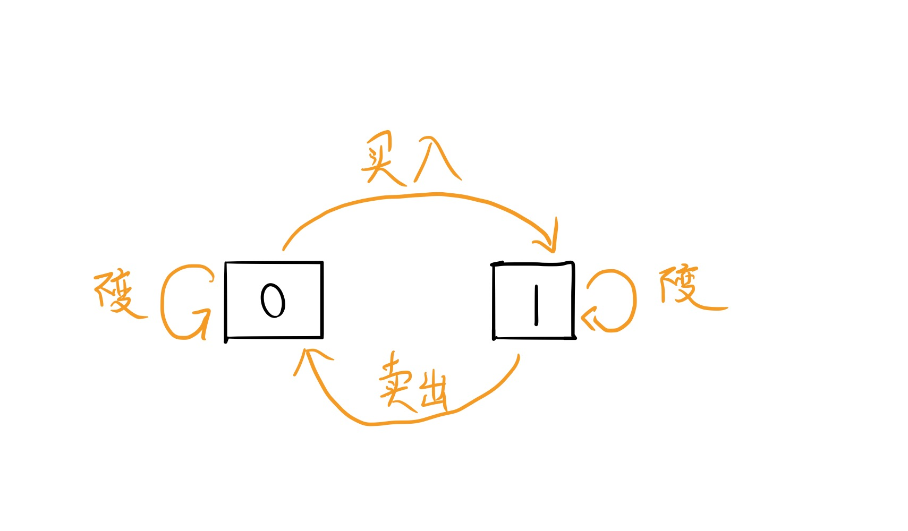

 
 
 
## 简介
- [题目链接](https://leetcode-cn.com/problems/best-time-to-buy-and-sell-stock/)
- [本地代码链接](./../code/JavaScript/121.js)

## 解题思路
### 解法一 - 暴力法
#### 思路
要想获得最大利润，就是获得卖出与买入的最大差值。
1. 维护一个变量 max，保存最大差值。假设我们在第 $i, i \epsilon [0, n-2]$ 天买入，在第 $j, j \epsilon [i+1, n-1]$ 卖出，两层循环不断更新 max 值。

**复杂度分析**：
- 时间复杂度： $O(N^2)$
- 空间复杂度： $O(1)$
```javascript
var maxProfit = function(prices) {
  let max = 0;
  for(let i = 0; i < prices.length-1; i++) {
    for(let j = i+1; j < prices.length; j++) {
      max = Math.max(max, prices[j] - prices[i]);
    }
  }

  return max;
};
```
### 解法二 - 暴力法改进
#### 思路
先来看一个思路：
1. 维护一个集合的最大值，如果我们每次从集合中取走一值，如何来更新这个最大值？我们需要重新遍历该集合寻找最大值来更新，因为只能遍历所有元素来确认最大值是否有变化。
2. 同样维护一个集合的最大值，然后每次往集合中添加一值，那么如何更新最大值？只需要添加的值和当前最大值比较即可，无需重新遍历。（最小值亦然）
 
按照这样的思路，我们可以将解法一去掉一层循环。
解法 1 抽象出来就是每次从集合中取出一个元素后，然后求该集合中的最大值（卖出值）。因此，我们反过来，维护买入的最小值。

算法步骤：
 1. 假设我们在第 $i$ 天卖出($i \epsilon [1, n-1]$ 之间)，维护一个变量 min（买入值）
 2. 以卖出值的角度来循环遍历，不断更新 min 和 答案

**复杂度分析**：   
- 时间复杂度：O(N)
- 空间复杂度：O(1)

```javascript
/**
 * @param {number[]} prices
 * @return {number}
 */

var maxProfit = function(prices) {
  if(prices.length <= 0) return 0;
  let max = 0;
  let min = prices[0];
  for(let i = 1; i < prices.length; i++) { // 第 i 天卖出
    max = Math.max(max, prices[i] - min);
    min = Math.min(min, prices[i]);
  }

  return max;
};
```


### 解法三 - 动态规划思路一
#### 思路
首先给出个结论：区间和和求差是两个可以相互转化的问题。
那么为什么两者之间可以进行转化？
微积分里面的牛顿-莱布尼茨公式告诉我们：
$\int^b_a f(x) {\rm d}x = F(x)\mid^b_a = F(b) - F(a)$，而 $F\prime(x) = f(x)$。微积分中，$x$ 的变化是连续的，而转换到本题当中，变量是离散的，但是并不影响到正确性。
因此，本题求最大的差值，可以转换成 最大连续子数组和 问题（这里的子数组存储的原数组的相邻元素的差值）。

算法步骤：
1. 遍历得出相邻元素的差值数组 diff
2. 维护另一个数组 dp，`dp[i]` 表示 i 之前的最大差值,也就是`diff[i]` 之前的最大子数组和，则 `dp[n]` 就是答案
  
**复杂度分析**：
- 时间复杂度：$O(N)$
- 空间复杂度：$O(N)$

```javascript
var maxProfit = function(prices) {
  if(prices.length <= 1) return 0;
  let diff = new Array(prices.length-1);
  let dp = new Array(prices.length).fill(0);
  let max;
  for(let i = 0; i < prices.length-1; i++) {
    diff[i] = prices[i+1] - prices[i];
  }
  dp[0] = diff[0] > 0 ? diff[0] : 0;
  max = dp[0];
  for(let i = 1; i < prices.length - 1; i++) {
    dp[i] = dp[i-1] + diff[i] > 0 ? dp[i-1] + diff[i] : 0;
    max = Math.max(dp[i], max);
  }

  return max;
}
```

**动态规划的改进**：
对于动态规划这类题，根据状态转换函数的特点，我们可以对空间进行相应的优化。
本题中 `dp[i]` 只依赖于 `dp[i-1]`，因此我们没有必要维护一个dp数组。

**复杂度分析**：
- 时间复杂度：$O(N)$
- 空间复杂度：$O(N)$，但是空间变为原来的一半
```javascript
var maxProfit = function(prices) {
  if(prices.length <= 1) return 0;
  let diff = new Array(prices.length-1);
  let dp = 0;
  let max;
  for(let i = 0; i < prices.length-1; i++) {
    diff[i] = prices[i+1] - prices[i];
  }
  dp = diff[0] > 0 ? diff[0] : 0;
  max = dp;
  for(let i = 1; i < prices.length - 1; i++) {
    dp = dp + diff[i] > 0 ? dp + diff[i] : 0;
    max = Math.max(dp, max);
  }

  return max;
}
```

**本题解法三的再改进**：
前面我们已经优化了 dp 数组，那么我们是否能够将 diff 数组也优化掉呢？
很明显，`diff[i]` 依赖于 `prices[i+1]` 和 `prices[i]`，也就是自变量只有 $i$。因此，我们可以将两个循环合并起来。

**复杂度分析**：
- 时间复杂度：$O(N)$
- 空间复杂度：$O(1)$
```javascript
var maxProfit = function(prices) {
  if(prices.length <= 1) return 0;
  let dp = 0;
  let max = 0;
  for(let i = 0; i < prices.length-1; i++) {
    let diff = prices[i+1] - prices[i];
    dp = dp + diff > 0 ? dp + diff : 0;
    max = Math.max(dp, max);
  }
  return max;
}
```

### 解法四 - 股票问题通用模板 - 状态机（动态规划）
#### 思路
思路参考[labuladong](https://leetcode-cn.com/problems/best-time-to-buy-and-sell-stock/solution/yi-ge-fang-fa-tuan-mie-6-dao-gu-piao-wen-ti-by-l-3/)

在任意一天中，我们只会有三种操作：
1. 买入 - buy：并且当前手中没有股票
2. 卖出 - sell：并且当前手中有股票
3. 不变
   - 买入后持有不变
   - 卖出后持有不变

因此，用状态机表示：

状态 0 表示当前没有持有股票，状态 1 表示当前持有股票。

而具体到题目中，我们可以用一个三维数组 $dp[n][k][s]$ 来表示整个解空间。
- $n$ 表示当前交易的天数
- $k$ 表示允许交易的最多次数
- $s$ 表示当前持有的状态，0 表示没有持有，1 表示持有

而最终的答案就是 $dp[n-1][k][0]$, $s$ 最后肯定不会为 1。使用反证法，如果为 1，则最后一次购入不买时的利润会比最终结果大，因此一定是 0。

下面我们可以得出整个状态转换公式：

$dp[i][k][0] = max(dp[i-1][k][0], dp[i-1][k][1] + prices[i]), i \epsilon [0,n)$

$dp[i][k][1] = max(dp[i-1][k][1], dp[i-1][k-1][0] - prices[i], i \epsilon [0,n)$

下面我们一一分析对应的 6 道题：
1. 允许交易一次：表示 $k$ 为 1
2. 允许交易多次：表示 $k$ 为正无穷，更严密的讲等于 $\lfloor n/2 \rfloor$。
3. 最多允许 2 次交易：表示 $k$ 为 2
4. 允许多次买卖，但包含冷冻期 1 天：情况 2 的变种
5. 允许交易 k 次
6. 可以多次交易，但每次交易有手续费：同样是情况 2 的变种

在给出每道题的具体答案时，我们先给出状态转换公式的边界情况：
- $dp[-1][k][s] = 0$，为 0 表示啥也不操作，也就不会产生利润 
- $dp[i][0][s] = -\infty$，表示不可能

#### 第一题：允许交易一次， $k=1$
公式变为：
- $dp[i][1][0] = max(dp[i-1][1][0], dp[i-1][1][1] + prices[i]), i \epsilon [0,n) => dp[i][0] = max(dp[i-1][0], dp[i-1][1] + prices[i])$  
- $dp[i][1][1] = max(dp[i-1][1][1], dp[i-1][0][0] - prices[i], i \epsilon [0,n) => dp[i][1] = max(dp[i-1][1], -prices[i])$

```javascript
var maxProfit = function(prices) {
  if(prices.length <= 1) return 0;
  let dp = new Array(prices.length);
  for(let i = 0; i < prices.length; i++) dp[i] = new Array(2).fill(0);

  dp[0][0] = 0;
  dp[0][1] = -prices[0];
  for(let i = 1; i < prices.length; i++) {
    dp[i][0] = Math.max(dp[i-1][0], dp[i-1][1] + prices[i]);
    dp[i][1] = Math.max(dp[i-1][1], -prices[i]);
  }
  return dp[prices.length-1][0];
}

```

**复杂度分析**：
- 时间复杂度： $O(N)$
- 空间复杂度：$O(N)$

**动态规划的空间优化**：
很明显 $dp[i][s]$ 只和 $dp[i-1[[s]$ 相关，因此我们可以优化空间
```javascript
var maxProfit = function(prices) {
  if(prices.length <= 1) return 0;
  
  let dp_0 = 0;
  let dp_1 = -prices[0];
  for(let i = 1; i < prices.length; i++) {
    dp_0 = Math.max(dp_0, dp_1 + prices[i]);
    dp_1 = Math.max(dp_1, -prices[i]);
  }
  return dp_0;
}
```

**复杂度分析**：
- 时间复杂度： $O(N)$
- 空间复杂度：$O(1)$

#### 第二题：允许交易多次， $k = +\infty$
当 $k = +\infty$ 时， $k = k - 1$

因此公式可以变为：
$dp[i][k][0] = max(dp[i-1][k][0], dp[i-1][k][1] + prices[i]), i \epsilon [0,n) => dp[i][0] = max(dp[i-1][0], dp[i-1][1] + prices[i])$

$dp[i][k][1] = max(dp[i-1][k][1], dp[i-1][k-1][0] - prices[i] = max(dp[i-1][k][1], dp[i-1][k][0]), i \epsilon [0,n) => dp[i][1] = max(dp[i-1][1], dp[i-1][0] - prices[i])$

同样的，由于 $dp[i][s]$ 只和 $dp[i-1[[s]$ 相关，我们可以优化代码的空间：
```javascript
var maxProfit = function(prices) {
  if(prices.length <= 1) return 0;
  
  let dp_0 = 0;
  let dp_1 = -prices[0];
  for(let i = 1; i < prices.length; i++) {
    let tmp = dp_0
    dp_0 = Math.max(dp_0, dp_1 + prices[i]);
    dp_1 = Math.max(dp_1, tmp - prices[i]);
  }
  return dp_0;
}
```

**复杂度分析**：
- 时间复杂度： $O(N)$
- 空间复杂度：$O(1)$

#### 第三题：最多允许 2 次交易

当 $k$ 有限的时候，我们是无法省略 $k$ 的。
因此，我们需要两层循环。

```javascript
var maxProfit = function(prices) {
  if(prices.length <= 1) return 0;
  
  let dp = new Array(prices.length);
  for(let i = 0; i < prices.length; i++) {
    dp[i] = new Array(3);
    for(let j = 0; j < dp[i].length; j++) {
      dp[i][j] = [0, 0];
    }
  }
  for(let i = 0; i < prices.length; i++) {
    for(let j = 1; j <= 2; j++) {
      if(i === 0) {
        dp[i][j][0] = 0;
        dp[i][j][1] = -prices[i];
        continue;
      }
      dp[i][j][0] = Math.max(dp[i-1][j][0], dp[i-1][j][1] + prices[i]);
      dp[i][j][1] = Math.max(dp[i-1][j][1], dp[i-1][j-1][0] - prices[i]);
    }
  }
  return dp[prices.length-1][2][0];
}
```
**复杂度分析**：
- 时间复杂度： $O(N)$
- 空间复杂度：$O(N)$

**动态规划的空间优化**:
因为本身 $k=2$ 非常小，因此我们可以将所有公式穷举出来。

$dp[i][1][0] = max(dp[i-1][1][0], dp[i-1][1][1] + prices[i])$
$dp[i][1][1] = max(dp[i-1][1][1], -prices[i])$
$dp[i][2][0] = max(dp[i-1][2][0], dp[i-1][2][1] + prices[i])$
$dp[i][2][1] = max(dp[i-1][2][1], dp[i-1][1][0]-prices[i])$

每个公式状态 $i$ 只依赖于 $i-1$，因此：
```javascript
var maxProfit = function(prices) {
  if(prices.length <= 1) return 0;
  
  let dp_1_0 = 0;
  let dp_1_1 = -prices[0];
  let dp_2_0 = 0;
  let dp_2_1 = -prices[0];
  for(let i = 1; i < prices.length; i++) {
    let tmp = dp_1_0;
    dp_1_0= Math.max(dp_1_0, dp_1_1 + prices[i]);
    dp_1_1 = Math.max(dp_1_1, -prices[i]);
    dp_2_0 = Math.max(dp_2_0, dp_2_1 + prices[i]);
    dp_2_1 = Math.max(dp_2_1, tmp - prices[i]);
  }
  return dp_2_0;
}
```
**复杂度分析**：
- 时间复杂度： $O(N)$
- 空间复杂度：$O(1)$


#### 第四题：最多允许 $k$ 次
当 $k > \lfloor n/2 \rfloor$ 时，本质上和 $k = +\infty$是一致的。
因此我们可以分为两种情况：
- $k > \lfloor n/2 \rfloor$
- $k <= \lfloor n/2 \rfloor$

```javascript
var maxProfit = function(k, prices) {
  let n = prices.length;
  if(n <= 1) return 0;

  if(k > Math.floor(n/2)) return maxProfitWithInf(prices);
  let dp = new Array(n);
  for(let i = 0; i < n; i++) {
    dp[i] = new Array(k+1);
    for(let j = 0; j <= k; j++) {
      dp[i][j] = [0, 0];
    }
  }
  for(let i = 0; i < n; i++) {
    for(let j = 1; j <= k; j++) {
      if(i === 0) {
        dp[i][j][0] = 0;
        dp[i][j][1] = -prices[i];
        continue;
      }
      dp[i][j][0] = Math.max(dp[i-1][j][0], dp[i-1][j][1] + prices[i]);
      dp[i][j][1] = Math.max(dp[i-1][j][1], dp[i-1][j-1][0] - prices[i]);
    }
  }
  return dp[n-1][k][0];  
  
  function maxProfitWithInf(prices) {
    let dp_0 = 0;
    let dp_1 = -prices[0];
    for(let i = 1; i < prices.length; i++) {
      let tmp = dp_0
      dp_0 = Math.max(dp_0, dp_1 + prices[i]);
      dp_1 = Math.max(dp_1, tmp - prices[i]);
    }
    return dp_0;    
  }
};

```

**复杂度分析**：
- 时间复杂度： $O(KN)$
- 空间复杂度：$O(KN)$

#### 第五题： 允许多次买卖，但包含冷冻期 1 天
情况 2 的变种。
$dp[i][0] = max(dp[i-1][0], dp[i-1][1] + prices[i])$

$dp[i][1] = max(dp[i-1][1], dp[i-2][0] - prices[i])$

```javascript
var maxProfit = function(prices) {
  if(prices.length <= 1) return 0;
  
  let dp_0 = 0;
  let dp_1 = -prices[0];
  let dp_2 = 0;
  for(let i = 0; i < prices.length; i++) {
    let tmp = dp_0;
    dp_0 = Math.max(dp_0, dp_1 + prices[i]);
    dp_1 = Math.max(dp_1, dp_2 - prices[i]);
    dp_2 = tmp;
  }
  return dp_0;
}
```
**复杂度分析**：
- 时间复杂度：$O(N)$
- 空间复杂度：$O(1)$
#### 第六题：可以多次交易，但每次交易有手续费
同样是情况 2 的变种。
$dp[i][0] = max(dp[i-1][0], dp[i-1][1] + prices[i] - fee)$

$dp[i][1] = max(dp[i-1][1], dp[i-1][0] - prices[i])$

```javascript
var maxProfit = function(prices, fee) {
  if(prices.length <= 1) return 0;
  
  let dp_0 = 0;
  let dp_1 = -prices[0];
  for(let i = 0; i < prices.length; i++) {
    let tmp = dp_0;
    dp_0 = Math.max(dp_0, dp_1 + prices[i] - fee);
    dp_1 = Math.max(dp_1, tmp - prices[i]);
    dp_2 = tmp;
  }
  return dp_0;
}
```
**复杂度分析**：
- 时间复杂度：$O(N)$
- 空间复杂度：$O(1)$