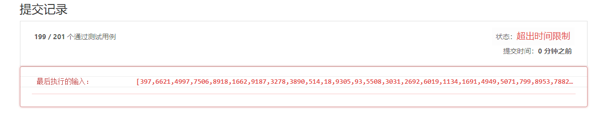

 
 
 
## 简介
- [题目链接](https://leetcode-cn.com/problems/best-time-to-buy-and-sell-stock-ii/)

## 解题思路
### 解法一 - 暴力法
#### 思路
首先题意告诉我们，可以进行多次买卖。
做完第一次买卖后，剩下的问题和整个问题是相同的，也就是同样操作的子问题，因此我们可以枚举所有的不同的第一次买卖，剩下的子问题用递归来解决。
1. 遍历所有的第一次操作，后面用递归解决子问题。


```javascript
var maxProfit = function(prices) {
  let n = prices.length;
  if(n <= 1) return 0;

  return helper(prices, 0);

  function helper(arr, start) {
    let profit = 0;
    for(let i = start; i < n-1; i++) {
      for(let j = i+1; j < n; j++) {
        if(arr[j] > arr[i]) {
          profit = Math.max(profit, arr[j] - arr[i] + helper(arr, j+1));
        }
      }
    }

    return profit;
  }
}
```
**复杂度分析**：
- 时间复杂度：$O(n^n)$
- 空间复杂度：$O(n)$ ，递归的深度为 $n$


如图 122-1 所示，算法明显会超时。

### 解法二 - 解法一改进
看解法一，很容易可以看出来很多子问题是重复的。
因此，我们可以用额外空间将已经计算好的子问题缓存起来，来避免重复计算。
```javascript
var maxProfit = function(prices) {
  let n = prices.length;
  if(n <= 1) return 0;
  let memo = new Array(n).fill(-1);

  return helper(prices, 0);

  function helper(arr, start) {
    if(start >= n-1) return 0;
    if(memo[start] !== -1) return memo[start];

    let profit = 0;
    for(let i = start; i < n-1; i++) {
      for(let j = i+1; j < n; j++) {
        if(arr[j] > arr[i]) {
          profit = Math.max(profit, arr[j] - arr[i] + helper(arr, j+1));
        }
      }
    }
    memo[start] = profit;
    return memo[start];
  }
}
```

**复杂度分析**:
- 时间复杂度：$O(n^3)$
- 空间复杂度：$O(n)$

**解法二的改进**：
同样和 [121-解法二](121.md) 的思路一样，我们可以省略掉一层循环，从而将时间复杂度由 $O(N^2)$ 变为 $O(N)$，这同样是一个非常大的改进。
```javascript
var maxProfit = function(prices) {
  let n = prices.length;
  if(n <= 1) return 0;
  let memo = new Array(n).fill(-1);

  return helper(prices, 0);

  function helper(arr, start) {
    if(start >= n-1) return 0;
    if(memo[start] !== -1) return memo[start];

    let profit = 0;
    let min = arr[start];
    for(let i = start+1; i < n; i++) {
      if(arr[i] > min) {
        profit = Math.max(profit, arr[i] - min + helper(arr, i+1));
      }
      min = Math.min(min, arr[i]);
    }
    memo[start] = profit;
    return memo[start];
  }
}
```
**复杂度分析**:
- 时间复杂度：$O(n^2)$
- 空间复杂度：$O(n)$

### 解法三 - 动态规划
通用解法看[121-解法四](121.md)

当 $k = +\infty$ 时， $k = k - 1$

因此公式可以变为：
$dp[i][k][0] = max(dp[i-1][k][0], dp[i-1][k][1] + prices[i]), i \epsilon [0,n) => dp[i][0] = max(dp[i-1][0], dp[i-1][1] + prices[i])$

$dp[i][k][1] = max(dp[i-1][k][1], dp[i-1][k-1][0] - prices[i] = max(dp[i-1][k][1], dp[i-1][k][0]), i \epsilon [0,n) => dp[i][1] = max(dp[i-1][1], dp[i-1][0] - prices[i])$

同样的，由于 $dp[i][s]$ 只和 $dp[i-1[[s]$ 相关，我们可以优化代码的空间：
```javascript
var maxProfit = function(prices) {
  if(prices.length <= 1) return 0;
  
  let dp_0 = 0;
  let dp_1 = -prices[0];
  for(let i = 1; i < prices.length; i++) {
    let tmp = dp_0
    dp_0 = Math.max(dp_0, dp_1 + prices[i]);
    dp_1 = Math.max(dp_1, tmp - prices[i]);
  }
  return dp_0;
}
```

**复杂度分析**：
- 时间复杂度： $O(N)$
- 空间复杂度：$O(1)$


### 解法四 - 贪心算法
本题是可以通过贪心策略来解决的。
那么为什么可以通过贪心来处理呢?

整个股票图是由连续上涨（包括只有相邻两天上涨）和连续下跌构成的。
1. 而连续上涨的利润由公式可以表示：
假设上涨交易日股票价格为 $p_1, p_2, ... , p_n$
则$p_1$ 买入并且 $p_n$卖出利润最大。
   - 而$p_n - p_1 = (p_2 - p_1) + (p_3 - p_2) + ... + (p_n - p_{n-1})$，等价于每天都进行买卖。
2. 连续下跌：不进行操作。

```javascript
var maxProfit = function(prices) {

  let profit = 0;
  for(let i = 0; i < prices.length - 1; i++) {
    if(prices[i+1] > prices[i]) profit += prices[i+1] - prices[i];
  }

  return profit;
}

```


**复杂度分析**：
- 时间复杂度： $O(N)$
- 空间复杂度：$O(1)$

