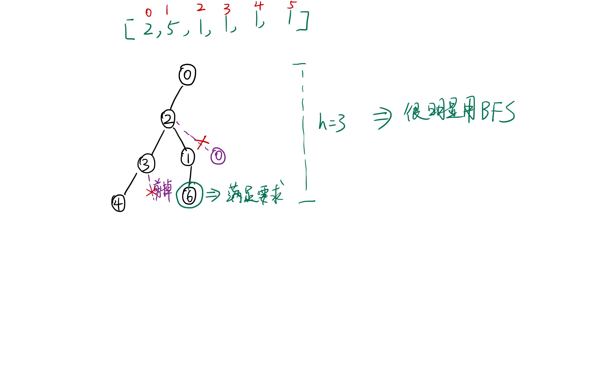

## 简介
- [LCP 09. 最小跳跃次数](https://leetcode-cn.com/problems/zui-xiao-tiao-yue-ci-shu/)

## 解法一 -BFS
题目需要求最少的按动次数。而每次的按动跳跃如下（假设我们在第 i 处按动）：
1. 跳到右边的 $i+jump[i]$
2. 跳到左边的 $[0, i)$ 的任意一处

我们由起点 $0$ 开始跳动。假设 $0$ 是根节点，那么由 $0$ 可能跳到的所有位置就是根节点的子节点。

推广到一般情况：
节点 $i$ 的子节点是 $i+jump[i]$ 和 $[0, i)$ 中的所有位置。很明显，这些位置也可能是其他节点的子节点。但是因为我们要求最少的按动次数，对应这棵树来讲，我们希望结束的深度是最小的。因此，我们希望每个节点出现的越早越好。

那么，我们如何通过代码表现各个节点出现的时间呢？
我们可以通过一个数组 $visited$ 来表示，如果该节点在前面已经处理过了，那么我们就此时就不在重复生成该位置的节点了。

对于这棵树来讲，我们希望找到最少的按动次数。就是找到某个结点的值大于等于数组长度，并且这个结点的深度是所有满足的结点中最小的。很显然，我们可以通过 BFS 来解决。



另外，我们在裁剪生成的子节点时，如何判断 $[0, i)$ 这个区间的子节点呢？如果每次都是重头去判断，效率肯定是不高的。

我们注意到，每次处理完 $i$ 的子节点后，其左边 $[0,i)$ 的所有位置一定是都被访问过的，因此，我们可以维持一个变量，比如 $max$。每次处理完 $i$ 节点后，我们就将其和 $max$ 来比较更新 $max$ 值。

这样，我们可以将时间复杂度降到最低。

```javascript
/**
 * @param {number[]} jump
 * @return {number}
 */
var minJump = function(jump) {
    
    let n = jump.length;
    let queue = [];
    let visited = new Array(n).fill(false);
    let max = 0;
    let dist = 0;

    queue.push(0);
    visited[0] = true;

    while(queue.length) {
        let len = queue.length;
        for(let i = 0; i < len; i++) {
            let top = queue.shift();
            let right = top + jump[top];
            if(right >= n) return dist+1; // 跳出位置

            if(!visited[right]) { // 判断右边的位置
                visited[right] = 1;
                queue.push(right);
            }

            for(let j = top - 1; j > max; j--) { // 判断左边剩余未访问过的位置
                if(!visited[j]) {
                    visited[j] = 1;
                    queue.push(j);
                }
            }
            max = Math.max(max, top);

        }
        dist++;
    }
    return -1;

};
```

**复杂度分析**：
- 时间复杂度： $O(N)$，$N$ 是数组长度
- 空间复杂度： $O(N)$

## 解法二 - BFS 的逆推（缓存步数）

假设 $dp[i]$ 表示在某个数组范围中从 $i$ 跳跃的最少次数。

那么我们很容易得到，$dp[n-1] = 1, n 是数组长度$。

那么我们得到:
$$
dp[i] = 
\begin{cases}
1, i+jump[i] >= n \\
dp[i+jump[i]] + 1
\end{cases}
$$

但是 $dp[i]$ 的更新，可能会影响到 $[i+1, n)$ 位置的值，如果 $dp[j] >= dp[i]+1$，此时我们需要更新 $dp[j]$ 的值。为什么？因为，每次 $i$ 往前移动一下，数组的范围就变了，因此，我们需要对该数组范围内的 $dp$ 值进行更新。

因为对于范围 $[i, n)$， 如果 $dp[j] >= dp[i]+1$，那么在 $j$ 中跳出去，我们可以从 $j$ 先跳到 $i$，然后我们再跳出去。因此，我们可以更新 $dp[j]$。

很显然，这种做法不能称之为动态规划，因为有后效性的存在。

```javascript
var minJump = function(jump) {
    let n = jump.length;
    let dp = new Array(n);
    dp[n-1] = 1;
    for(let i = n - 2; i >= 0; i--) {
        dp[i] = (jump[i] + i >= n ? 1 : dp[jump[i] + i] + 1);
        for(let j = i+1; j < n && dp[j] >= dp[i]+1; j++) dp[j] = dp[i] + 1;
    }
    return dp[0];
};
```

因为不需要队列的操作，因此实际时间复杂度系数比解法一更低。

**复杂度分析**:
- 时间复杂度：$O(N)$，常系数比解法一低
- 空间复杂度：$O(N)$，常系数比解法一低