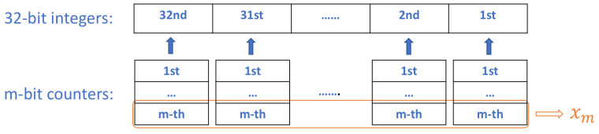

---
title: 137. 只出现一次的数字 II
sidebarDepth: 0
autoPrev: "136"
---  
 
 
## 简介
- [137. 只出现一次的数字 II](https://leetcode-cn.com/problems/single-number-ii/)

## 思路
### 解法一：哈希表
很明显，类似于[136 题](136.md)，我们可以通过统计元素个数来解决此问题。

```javascript
/**
 * @param {number[]} nums
 * @return {number}
 */
var singleNumber = function(nums) {
    let map = {};
    for(let i = 0; i < nums.length; i++) {
      if(map[nums[i]])map[nums[i]]++;
      else map[nums[i]] = 1;
    }
    for(let elem in map) {
      if(map[elem] === 1) return elem;
    }
};
```

**复杂度分析**:
- 时间复杂度：$O(N)$
- 空间复杂度：$O(N)$

### 解法二 - 排序后处理
1. 先对数组进行升序排序
2. 处理边界情况，数组头部和尾部，如果头或尾的元素和相邻元素不相等，则该元素即是答案
3. 否则，如果元素和左右相邻元素都不相等，即是答案

```javascript
var singleNumber = function(nums) {
    if(nums.length === 1) return nums[0];
    nums.sort((a, b) => a-b);
    if(nums[0] !== nums[1]) return nums[0];
    if(nums[nums.length-1] !== nums[nums.length-2]) return nums[nums.length-1];

    for(let i = 1; i < nums.length-1; i++) {
      if(nums[i] !== nums[i-1] && nums[i] !== nums[i+1]) return nums[i];
    }
};
```

**复杂度分析**:
- 时间复杂度：$O(NlogN)$
- 空间复杂度：$O(1)$

### 解法三 -  位运算
对于计算机来讲，所有的整数都是二进制。因此，我们先将所有的整数转换成二进制在来看看是否能找到规律：
``` tex
假设操作的数组为 [2, 2, 3, 2]，表示成二进制为：
1 0
1 0
1 1
1 0

第一列 4 个 1
第二列 1 个 1

```

很明显，相同的数二进制都是相同的，具体到每一个 bit。因此，每一个bit列中1的个数为 $3*i + j$，j 是答案在该 bit 列是 1 还是 0。
因此，我们可以统计每一列中 1 的个数得到答案：
假设这里是 32 位整数：
```javascript
/**
 * @param {number[]} nums
 * @return {number}
 */
var singleNumber = function(nums) {
   let ans = 0;
   for(let i = 0; i < 32; i++) {
     let count = 0;
     for(let j = 0; j < nums.length; j++) {
       if((nums[j]>>i&1) === 1) count++;
     }
     if(count % 3 === 1) {
       ans += 1<< i;
     }
   }
   return ans; 
};
```

**复杂度分析**:
- 时间复杂度：尽管常数系数为 32，但是仍然是 $O(N)$
- 空间复杂度：$O(1)$

### 解法四 - 位运算（通用性解法）
[参考文章](https://leetcode.com/problems/single-number-ii/discuss/43295/Detailed-explanation-and-generalization-of-the-bitwise-operation-method-for-single-numbers)

我们将问题一般化：
给定一个非空整数数组，该数组只有一个数出现了 p 次，其他数都出现 k 次。
其中 $k > 1$，$p >= 1, p  \mod k \ne {0}$。找到出现了 p 次的数。

**先考虑特殊情况： 1-bit 整数，也就是只有 0 和 1。**
我们需要一个 counter 来统计 1 的个数，该counter的内部运算是：当统计到 k 个 1时，counter 需要归原始状态。假设 counter 是有 m bits: $x_m,...,x_2,x_1$
1. counter 有一个初始状态，为了简洁化，设置为 0
2. 对于 array 中的每一个输入，如果 counter 遇到 0，保持不变
3. 如果遇到 1，counter 递增
4. 为了能够统计次数达到 k，我们需要 $2 ^m >= k$，这表示 $m >= logk$

为了满足条件2，有 `x | 0 = x` 或者 `x ^ 0 = x`。

下面来看具体的 counter 计算情况：
1. counter 被初始化为 $x_m = 0, ..., x_1 = 0$
2. 遇到 0 不变， 遇到 第一个 1， $x_m = 0, ..., x_1 = 1$。 遇到 第二个 1，$x_m = 0, ..., x_2 = 1, x_1 = 0$。此时明显 `x | 1 = 1`不满足，因此，我们选择 `x ^ 0 = x`。
   - 观察规律可知，要想递增导致 $x_m$ 产生变化， 需要前置状态为 $x_m-1...x_1$ 都为 1，因此我们得到公式：`x_m = x_m ^ (x_{m-1} & ... & x_1 & i)`
3. 因为 counter 从 $[0, 2^m-1]$ 变化，但是很多时候 $k < 2^m$，因此我们需要counter统计到 k 后能够直接回归到 0. 因此，我们引入 mask，并且保证 mask 满足两点：
    - 当统计到 k 时，mask 为 0
    - 其他统计状态，都为 1

    仔细分下，如何区分k和其他数字？很明显是每个bit上面的数字。假设 k 转成 二进制为 $k_mk_{m-1}...k_2k_1$，那么 mask的公式为：
    `mask = ~(y_m...y_2y_1), y_i = x_i if k_i = 1, y_i = ~x_i if k_i = 0`.

因此，我们得到整个的算法：
```javascript
for(let i of nums) {
  xm ^= (xm-1 & ... x2 & x1 & i);
  ...
  x1 ^= i;
  mask = ~(y_m...y_2y_1), y_i = x_i if k_i = 1, y_i = ~x_i if k_i = 0;
  xm &= mask;
  ......
  x1 &= mask; 

}
```

**前面我们考虑的都是 1-bit number，现在回归到 32-bit number上面。**

我们可以直接采用 32 个独立的 counter来计算（也就是解法3）。但是，如果想要充分的运动bitwise operation。我们可以使用 m 个 32-bit number 来替代 32 个 m-bit counter。



**那么返回什么？**:
根据 p 来返回具体的 xi:
1. k = 2, p = 1 : 此时只需要一个 32-bit number，假设为 x1, 此时不需要掩码：
```javascript
function singleNumber(nums) {
  let x1 = 0;
  for (let elem of nums) {
    x1 ^= i;
  }
  return x1;
}
```
2. k = 3, p = 1，$2^2 = 4$，需要两个 32-bit number，假设为 x1, x2 ：

```javascript
function singleNumber(nums) {
  let x1 = 0;
  let x2 = 0;
  let mask = 0;
  for(let elem of nums) {
    x2 ^= (x1 & elem);
    x1 ^= elem;
    mask = ~(x2&x1);
    x2 &= mask;
    x1 &= mask;
  }
  return x1 | x2;
}

```
3. k= 5, p = 3

```javascript
function singleNumber(nums) {
  let x1 = 0;
  let x2 = 0;
  let x3 = 0;
  let mask = 0;
  for(let elem of nums) {
    x3 ^= (x2 & x1 & elem); 
    x2 ^= (x1 & elem);
    x1 ^= elem;
    mask = ~(x3&~x2&x1);
    x3 &= mask;
    x2 &= mask;
    x1 &= mask;
  }
  return x1;// Since p = 3, in binary form p = '011', then p1 = p2 = 1, so we can return either x1 or x2. 
                    // If p = 4, in binary form p = '100', only p3 = 1, which implies we can only return x3.
                    // Or alternatively we can simply return (x1 | x2 | x3).
}

```


**复杂度分析**:
- 时间复杂度： $O(N)$
- 空间复杂度： $O(1)$

参考文章真是让人叹为观止。